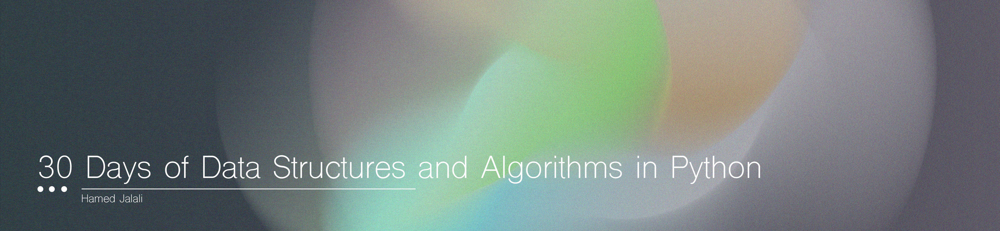

# Day 2

 

<strong>What is in day 1?</strong>  

   - [Data Types](#Data-Types)
    

 

# Data Types

## Strings

**Definition:** Strings in Python are sequences of characters.

**Creation:** You can create strings using single, double, or triple quotes.

**Immutability:** Once a string is created, it cannot be changed.

**Operations:**
- `Concatenation`: Combining strings using `+`
         - `"Hello" + " World" results in "Hello World"`
- `Repetition`: Repeating strings using `*`.
- `Indexing`: Accessing characters by their position.
- `Slicing`: Extracting a part of a string.

**Methods:**
- `.upper()`, `.lower()`: For case conversion.
- `.strip()`: Removing whitespace.
- `.split()`: Splitting a string into a list.
- `.join()`: Joining a list into a string.
- `.replace()`: Replacing parts of a string.
- `.find()`, `.index()`: Finding substrings.
